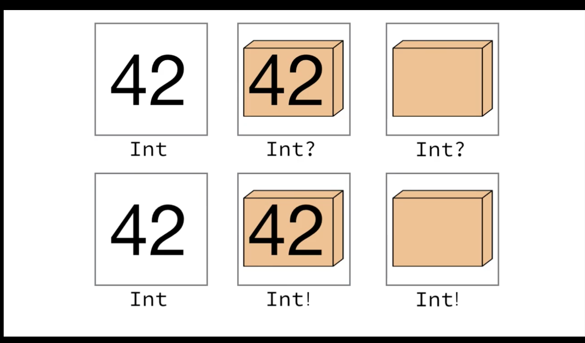
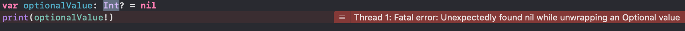
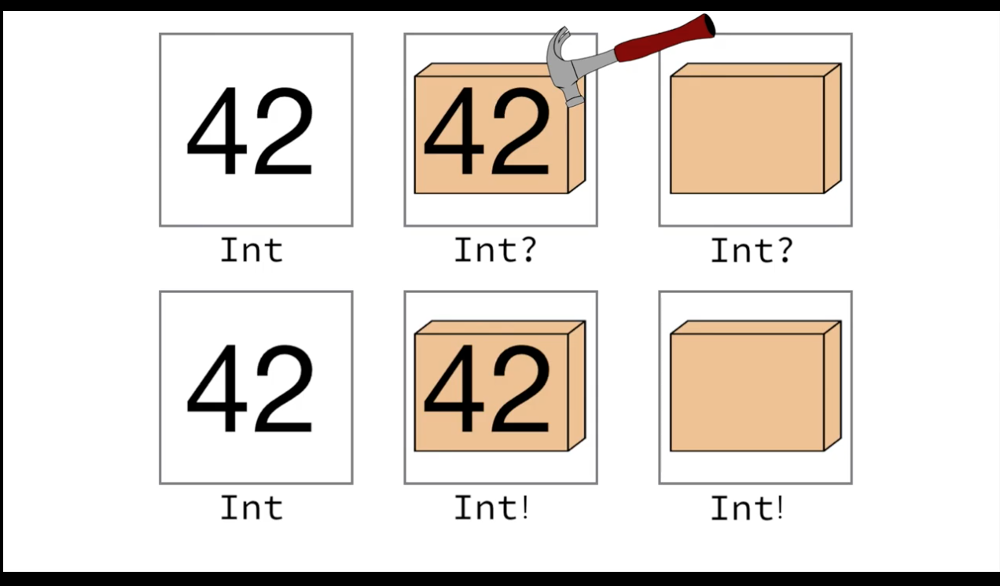

# 19.11.06(옵셔널,구조체,클래스)

## Optional

Optional = enum + general

값이 "있을 수도, 없을 수도" 있음

### 선언
`let optionalValue: Optional<Int> = nil`

`let optionalValue: Int? = nil`

`var optionalValue: Int! = 100`

### 왜 필요한가?

1. 변수에 값이 담길때 nil이 담길 가능성을 문서나 다른 자료를 통해 전달하지 않아도 코드만으로 표현이 가능하기 때문
> 문서/주석 작성시간이 절약

2. 전달받은 값이 optional이 아니라면 nil체크를 하지않더라도 안심할 수 있다.
> 효율적인 코딩,예외처리에 좀 더 안전하다.

ex)

```swift
// 옵셔널을 사용한 경우
func someFunction(someOptionalParam:Int?) {} 

// 옵셔널을 사용하지 않은경우
func someFunction(someParam:Int) {}

someFunction(someOptionalParam:nil) // 이상없음

someFunction(someParam:nil) // 컴파일단계에서 에러발생
```

### Implicitly Unwrapped Optional(암시적 추출 옵셔널)

느낌표(!)가 붙는경우
`var optionalValue: Int! = 100`

- 기존 변수처럼 사용가능
```swift
optionalValue = optionalValue + 1
```
- nil도 할당 가능
```swift
optionalValue = nil
```
- **잘못된 접근을 한다면 런타임오류 발생**
```swift
optionalValue = nil
optionalValue = optionalValue + 1
```

### Optional
물음표(?)가 붙는경우

```swift
// Int값이 들어있을수도 없을수도 있다.
var optionalValue: Int? = 100
```

- nil 할당 가능

`optionalValue = nil`

- 기존 변수처럼 사용이 불가

```swift
// 옵셔널값과 일반 값들은 타입이 다르므로 연산이 불가능하다.
optionalValue = optionalValue + 1
```

### Optional Unwrapping

옵셔널 추출에는 두가지 방법이 있다.

1. Optional Binding(옵셔널 바인딩)
2. Force Unwrapping(강제 추출)

#### Optional Binding

nil체크 + 안전한 값 추출이 가능하다.

> 값을 보호하는 방어벽이 있다.

1. if-let 방식을 통한 옵셔널 바인딩

```swift
var optionalValue: Int? = 100
// if-let 안에서만 사용이가능하다. 스코프를 벗어나서 컴파일 오류 발생
if let val: Int = optionalValue {
    print("optional value is \(val)")
} else {
    print("optional value is nil")
}
```
1-2. 한번에 여러개 바인딩이 가능하다.

```swift
var optionalValue: Int? = 100
var optionalValue2: String? = "hong3"

if let val = optionalValue, let name: String = optionalValue2{
    print("optional value is \(val)")
    print("hello \(name)")
} else {
    print("optional value is nil")
}
```
1-3 여러개를 바인딩할때 하나가 nil이라면?


```swift
var optionalValue: Int? = 100
var optionalValue2: String? = nil

if let val = optionalValue, let name: String = optionalValue2{
    print("optional value is \(val)")
    print("hello \(name)")
} else {
    print("found nil")
}
```
> else로 빠져나가게 된다.

#### ~~Force Unwrapping~~(비추)

옵셔널 타입의 값을 **강제로 추출**하게된다.

**추천하지 않는방법이다.**

```swift
var optionalValue: Int? = 100
print(optionalValue!)
```

만약 변수에 nil이 들어있다면

 
>런타임 오류가 발생한다.

 
 > 뚝배기를 부셔버렸다.
 
 